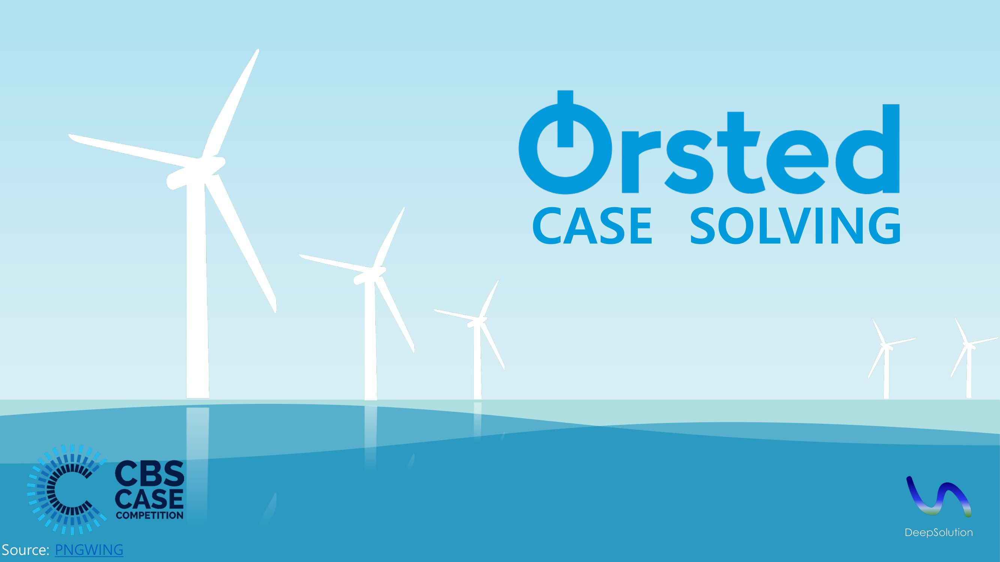
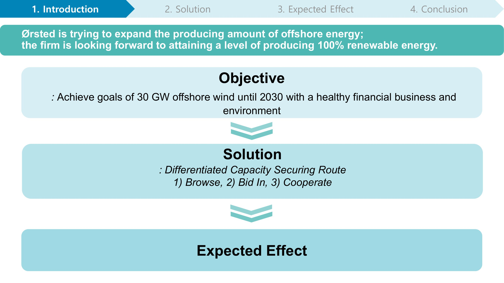
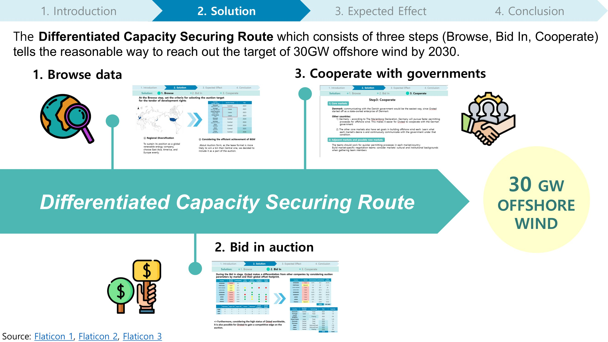
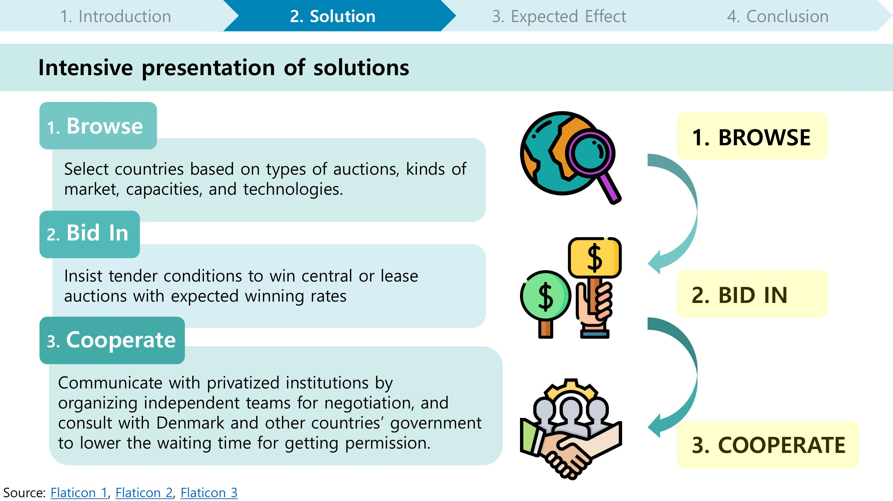
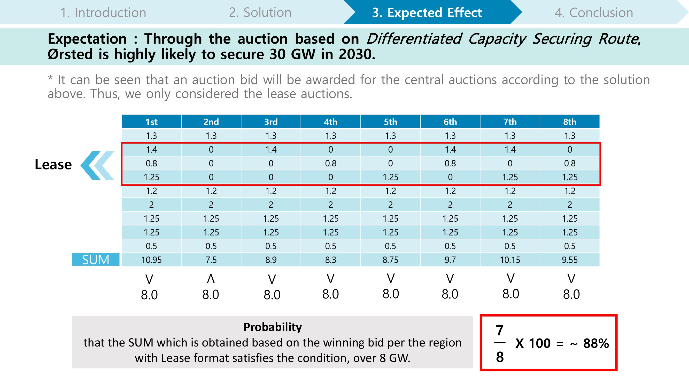
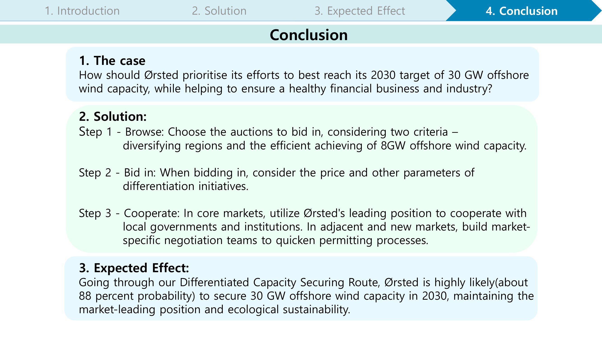

# CBS-Case-Competition
- 2023/Feb/13-14
- Details about the Competition: https://www.casecompetition.com/global/ 
- Team Members : 오유진(Ewha Womans Univ, Dept of Artificial Intelligence), 전아영(George Mason Unive, Business Management), 박서형(Korea Univ, Dept of Architecture), 김주영(Yonsei Univ, 
Business Administration)
  
### Our team named **"DeepSolution"** suggested solutions for **Ørsted** company at the **CBS Case Competition**:  
  
Although we could not go to semi-final as a result, it was a great chance for us to improve problem-solving skills and think of how to provide more daring perspectives.

*NOTICE : Full PPT is provided in DeepSolution.pdf file.
  

